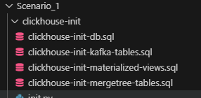

# Scenario 1: Clickhouse & Kafka Challenge

This checklist helps set up a ClickHouse instance that consumes CDC messages from Kafka via Debezium and stores them in final MergeTree tables.

---

# Deliverables

- ClickHouse Database and Table Schemas

  

# Task 1 - Checklist

- [x] Create Clickhouse Instance:
  - [x] Create Clickhouse server using docker or self hosted single instance instance.
  - [x] Modify the clickhouse server config file as necessary. 
  - [x] Create 2 databases inside clickhouse instance, One for (kafka_tables, demo_tables)

- [x] Create Kafka Consumer (kafka_tables):
  - [x] Using Clickhouse’s ability to consume kafka topics directly (Kafka Engine) , prepare the script necessary to consume messages from kafka, make sure you align the consumer with schema registry to deserialize the messages properly.
  - [x] Replicate the previous step for the remaining topics.

- [x] Create MergeTree Tables (kafka_tables):
  - [x] Create 3 MergeTree Table Engine to store all the messages for each table.
  - [x] Make sure you add kafka_timestamp field to each table that holds the default value of current timestamp and it should be filled automatically (default value)

- [x] Create Necessary Extraction/Transformation Materialized views:
  - [x] listen and extract changes for (products) tables consumed from the kafka table to their destination MergeTree table.
  - [x] Replicate the previous step for the remaining tables.

- [x] Test your work:
  - [x] Insert dummy products/orders and make sure they are reflected in the final MergeTree tables in clickhouse.
  - [x] For debugging, Use : http://localhost:8087 and login using (admin@test.com, admin) register the cluster once (don’t forget to add the schema registry URL) and monitor the CDC messages lifecycle. You can show the logs for any docker service to see the errors and apply the necessary fixes.

# Data Consistency: Ensure that historical data is backfilled if necessary.
Backfill_data.py: Fetches rows from MySQL based on a specific backfill date and filters out records already present in ClickHouse using their IDs. Inserts only the new rows into ClickHouse to avoid duplication.

### Challenges and Solutions

During the implementation of the backfill and ingestion pipeline, several challenges were encountered:

* **Data Consistency:** Ensuring no duplicate or missing records was addressed by cross-verifying primary keys in ClickHouse before insert operations.
* **Schema Evolution:** Adjustments were made to handle minor schema changes between historical and live data by standardizing data types during transformation.

---

### Summary of Optimization Benefits

The implemented optimizations brought measurable benefits:

* **Improved Data Processing Efficiency:** Batch inserts and filtered backfill reduced overhead and processing time.
* **Data Consistency:** The pipeline guarantees high integrity between source (MySQL) and sink (ClickHouse) through ID-based filtering and backfill controls.

---

### Future Recommendations

To enhance pipeline scalability and resilience, the following are recommended:

* **Scaling with Kafka Partitions:** Distribute load across more consumers for higher throughput.
* **Monitoring & Alerting:** Integrate observability tools for offset lag, throughput, and failure detection.
